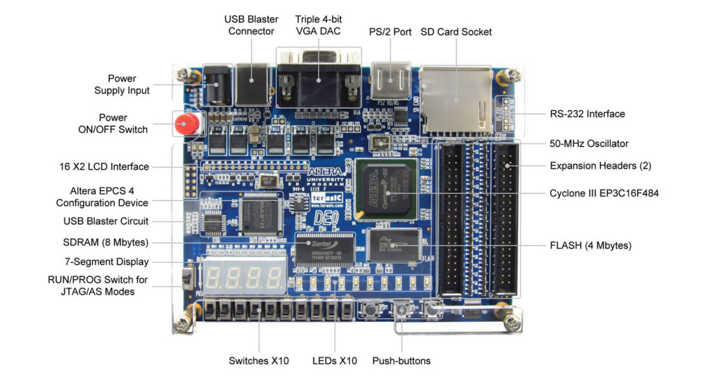

# CS232
Code I wrote for the Colby College computer science course CS232: Computer Organization.

The repository contains VHDL code I wrote to program the Altera DE0 Cyclone III FPGA.  
Components of the board used in projects so far include:
 - 7-segment displays
 - Switches
 - Push Buttons
 - LEDs


Figure 1. Diagram of Altera DE0 Cyclone III FPGA board layout from the Altera DE0 User Manual.

## Directory Layout
```
CS232
├── README.md
├── assets
│   └── altera_de0_layout.png
├── project_1
│   ├── lab_1
│   │   ├── README.md
│   │   ├── circuit1.bdf
│   │   ├── circuit1.vhd
│   │   └── testbench.vhd
│   ├── prime
│   │   ├── README.md
│   │   ├── prime.bdf
│   │   ├── prime.vhd
│   │   └── prime_testbench.vhd
│   ├── prime_extension
│   │   ├── README.md
│   │   ├── prime_extension.bdf
│   │   ├── prime_extension.vhd
│   │   └── prime_extension_testbench.vhd
│   └── traffic
│       ├── README.md
│       ├── lpm_counter0.vhd
│       ├── traffic.bdf
│       └── traffic.vhd
├── project_2
│   ├── flash
│   │   ├── README.md
│   │   ├── boxdriver.vhd
│   │   ├── boxtest.vhd
│   │   ├── flash.bdf
│   │   ├── flash.vhd
│   │   └── lpm_counter0.vhd
│   ├── signed_adder_extension
│   │   ├── README.md
│   │   ├── hexdisplay.vhd
│   │   ├── signed_adder.vhd
│   │   ├── signed_adder_extension.bdf
│   │   └── signed_adder_extension.vhd
│   ├── task1
│   │   ├── README.md
│   │   ├── hexdisplay.vhd
│   │   ├── lpm_counter0.vhd
│   │   ├── task1.bdf
│   │   └── task1.vhd
│   └── task2
│       ├── README.md
│       ├── adder.vhd
│       ├── hexdisplay.vhd
│       ├── task2.bdf
│       └── task2.vhd
├── project_3
│   ├── bright
│   │   ├── README.md
│   │   ├── bright.vhd
│   │   └── brighttest.vhd
│   ├── fix_reaction_timer_vulnerability_extension
│   │   ├── README.md
│   │   ├── fix_reaction_timer_vulnerability.bdf
│   │   ├── fix_reaction_timer_vulnerability.vhd
│   │   ├── fixed_timer.vhd
│   │   └── hexdisplay.vhd
│   ├── reaction
│   │   ├── README.md
│   │   ├── hexdisplay.vhd
│   │   ├── reaction.bdf
│   │   ├── reaction.vhd
│   │   ├── reaction_test.vhd
│   │   └── timer.vhd
│   └── shortest_reaction_time_extension
│       ├── README.md
│       ├── hexdisplay.vhd
│       ├── shortest_reaction_time.bdf
│       ├── shortest_reaction_time.vhd
│       └── shortest_reaction_timer.vhd
└── project_4
    └── calc
        ├── README.md
        ├── alu.vhd
        ├── calc.vhd
        └── calcbench.vhd

```